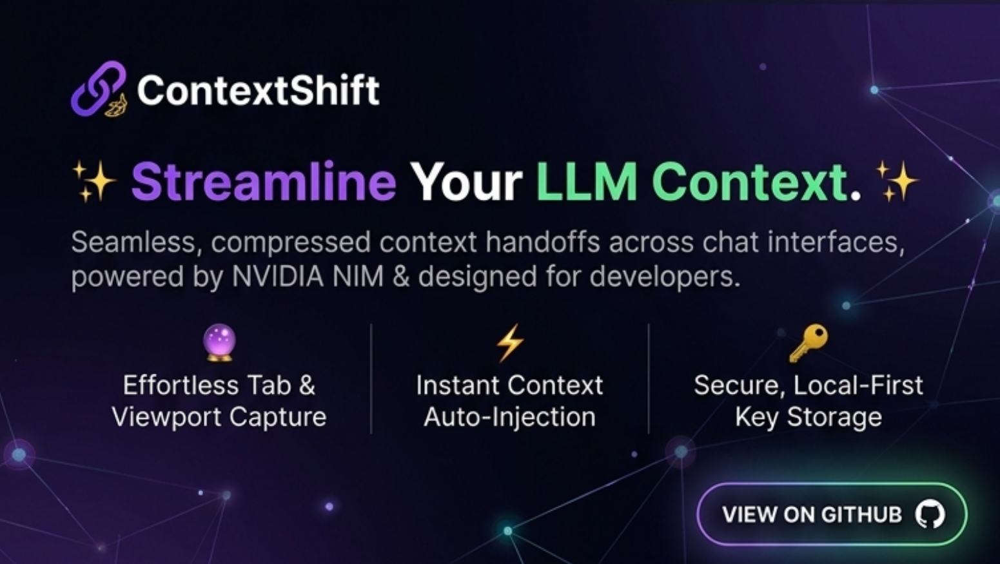
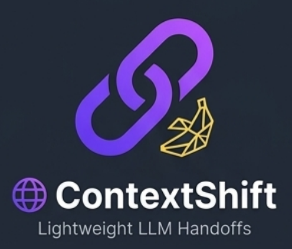

<p align="center">
  
</p>

<p align="center">
  
</p>

<h1 align="center">ContextShift</h1>

<p align="center">
  <strong>Seamless, compressed AI context handoffs across LLM chat interfaces.</strong><br>
  Powered by NVIDIA NIM &amp; engineered for developers who live in multiple AI tabs at once.
</p>

<p align="center">
  
  
  
  
  
</p>

<p align="center">
  <a href="#-quick-start">Quick Start</a> &nbsp;·&nbsp;
  <a href="#-features">Features</a> &nbsp;·&nbsp;
  <a href="#%EF%B8%8F-architecture">Architecture</a> &nbsp;·&nbsp;
  <a href="#-privacy">Privacy</a> &nbsp;·&nbsp;
  <a href="#-troubleshooting">Troubleshooting</a>
</p>

---

## What is ContextShift?

ContextShift is a **privacy-first Chrome Extension** that captures your AI conversation from one platform and instantly transfers a compressed, formatted version of it to another — no copy-pasting, no re-explaining, no backend server.

Switch from ChatGPT to Claude mid-conversation. Carry your full context over in one click.

---

## ✦ Features

| | Feature | Description |
|---|---|---|
| 🔮 | **Effortless Capture** | One-click extraction from any supported AI platform via the floating overlay |
| ⚡ | **Instant Auto-Injection** | Pastes formatted context directly into a target AI's chat input — opens the tab for you |
| 🧠 | **NVIDIA NIM Compression** | Streaming smart summarization via Llama 3.2 through the NVIDIA NIM API |
| 📋 | **Copy to Clipboard** | Copies processed context as formatted Markdown ready to paste anywhere |
| 🕵️ | **Shadow DOM Overlay** | Floating panel injected with full Shadow DOM isolation — host-page CSS can never break it |
| 📚 | **Local Capture History** | Last 10 captures compressed and saved locally, reloadable from the popup |
| 🔒 | **Local-First Privacy** | API key and all conversation data stored only in Chrome's local extension storage |
| ⚙️ | **Settings Page** | Configure NIM key, summarization mode, max context length, and history preferences |

---

## 🌐 Supported Platforms

<table>
  <tr>
    <td align="center">🤖<br><b>ChatGPT</b><br><code>chatgpt.com</code></td>
    <td align="center">🧡<br><b>Claude</b><br><code>claude.ai</code></td>
    <td align="center">♊<br><b>Gemini</b><br><code>gemini.google.com</code></td>
    <td align="center">🔍<br><b>Perplexity</b><br><code>perplexity.ai</code></td>
    <td align="center">𝕏<br><b>Grok</b><br><code>grok.com</code></td>
  </tr>
</table>

---

## 🚀 Quick Start

### 1 — Install the Extension

```bash
git clone https://github.com/talha307841/copycontext.git
```

1. Open Chrome and navigate to `chrome://extensions`
2. Enable **Developer Mode** (toggle in the top-right corner)
3. Click **Load unpacked** → select the `contextshift/` folder
4. The extension icon appears in your Chrome toolbar

### 2 — (Optional) Configure NVIDIA NIM

> Skip this step to use the built-in local extractive summarizer instead.

1. Get a **free** API key at [build.nvidia.com](https://build.nvidia.com)
2. Click the ContextShift extension icon → press **⚙ Settings**
3. Paste your key and click **Save & Test Connection**

### 3 — Start Shifting Context

| What you want | How to do it |
|---|---|
| **Capture** current conversation | Open a supported AI chat → click **▶ Capture Conversation** on the floating panel |
| **Copy** context to clipboard | Click **📋 Copy** on the overlay or in the popup |
| **Inject** into another AI | Pick a target in the popup → click **Auto-Inject →** |
| **Summarize** with NIM | Click **Generate Smart Summary** in the popup after capturing |

---

## 🏗️ Architecture

```
contextshift/
├── manifest.json          # MV3 extension manifest — permissions & content scripts
├── background.js          # Service worker: NIM API calls, message routing, LZString storage
├── content.js             # Content script: conversation extraction + Shadow DOM overlay
├── summarizer.js          # NVIDIA NIM streaming client + local extractive fallback
├── storage.js             # LZ-String compress/decompress helpers
├── config.js              # Runtime config: NIM endpoint, model ID, token limits
├── lz-string.min.js       # Context compression (reduces storage footprint ~70%)
├── popup/
│   ├── popup.html         # Extension popup — Inter UI + Fira Code preview card
│   ├── popup.css          # Vercel-inspired developer dark theme
│   └── popup.js           # Popup logic: capture → generate → transfer flow
├── options/
│   ├── options.html       # Full settings page
│   ├── options.css
│   └── options.js         # API key persistence, NIM test ping, preference controls
└── icons/
    ├── icon16.png
    ├── icon48.png
    └── icon128.png
```

### Message Flow

```
Floating Overlay  ──► background.js ──► NVIDIA NIM API  (optional, streaming)
(content.js)              │
                          └──► content.js  ──►  target chat input
                                (INJECT_TEXT)
```

The overlay's **Capture** button sends `CAPTURE_AND_STORE_FROM_TAB` → background extracts the conversation via `GET_CONVERSATION`, formats it, compresses it with LZString, and stores it in `cs_last_context`.

The **Inject** button sends `NIM_SUMMARIZE_AND_PASTE` → background decompresses, streams a NIM summary (or falls back to local extraction), then dispatches `INJECT_TEXT` back to the content script which drives the platform-specific input element.

### Storage Keys

| Key | Type | Description |
|---|---|---|
| `nim_api_key` | `string` | NVIDIA NIM API key (local only) |
| `summ_mode` | `"full" \| "smart" \| "custom"` | Active summarization mode |
| `cs_last_context` | LZString blob | Latest captured context object |
| `cs_history` | LZString array (max 10) | Capture history ring buffer |
| `cs_nim_stream` | object | In-progress or last NIM stream state |
| `save_history` | `boolean` | Whether to persist history |

---

## 🔒 Privacy

> **Your data never leaves your device unless you explicitly configure a NIM API key and trigger a summarization.**

| Data | Where it goes |
|---|---|
| Captured conversations | Chrome `storage.local` — your device only |
| NVIDIA NIM API key | Chrome `storage.local` — your device only |
| Capture history | Chrome `storage.local` — your device only |
| NIM summarization payload | `integrate.api.nvidia.com` only — opt-in, only when key is set and Generate is clicked |

No backend. No analytics. No telemetry. No accounts required for core functionality.

---

## 🛠 Troubleshooting

<details>
<summary><b>Overlay appears but capture always fails</b></summary>

- Refresh the AI tab once after loading the extension
- Scroll the conversation up to ensure all messages are in the DOM
- Verify you're on a supported domain (see Supported Platforms above)
- Reload the extension at `chrome://extensions` then refresh the AI tab

</details>

<details>
<summary><b>Capture reports success but inject / paste is empty</b></summary>

- Re-capture on the current tab — older pre-2.0 captures may be stale
- Confirm the target tab finished loading before injecting (wait for the input area to appear)

</details>

<details>
<summary><b>Auto-inject opens the tab but text never appears</b></summary>

- The target platform's input editor may not have finished mounting — the extension retries with a 1.5 s delay
- If it still fails, use **Copy** as a fallback and paste manually (`Ctrl+V`)

</details>

<details>
<summary><b>NVIDIA NIM shows "No API key" or "Offline"</b></summary>

- Go to **⚙ Settings** → paste your key → click **Save & Test**
- Get a free key at [build.nvidia.com](https://build.nvidia.com)
- Without a key, the extension automatically uses the local extractive summarizer

</details>

<details>
<summary><b>Extension icon is missing or shows an error</b></summary>

- Verify `contextshift/icons/` contains valid `icon16.png`, `icon48.png`, and `icon128.png` files
- File names must match `manifest.json` exactly

</details>

---

## 🧪 Development

No bundler or `npm` required. Pure vanilla JavaScript, MV3.

```bash
# 1. Clone
git clone https://github.com/talha307841/copycontext.git

# 2. Load in Chrome
# chrome://extensions → Developer Mode ON → Load unpacked → select contextshift/

# 3. Make changes to any .js / .html / .css file
# 4. Click the ↺ reload button on the extension card in chrome://extensions
# 5. Refresh the AI tab
```

**Recommended test matrix:**

- [ ] Chrome stable on each of the 5 supported platforms
- [ ] Short chat (< 5 msgs) and long chat (> 30 msgs)
- [ ] Capture → Copy → manual paste
- [ ] Capture → Generate Smart Summary (NIM) → Auto-Inject
- [ ] Popup history: capture twice, reload popup, click history entry
- [ ] Options: save key → Test Connection → Clear History → reload popup

---

## 📄 License

[MIT](LICENSE) — free to use, fork, and distribute.

---

<p align="center">
  Built with 💜 for developers who live in multiple AI tabs at once.
</p>


Supported platforms:
- ChatGPT (`chat.openai.com`, `chatgpt.com`)
- Claude (`claude.ai`)
- Gemini (`gemini.google.com`)
- Perplexity (`perplexity.ai`, `www.perplexity.ai`)
- Grok (`grok.com`, `x.com/i/grok`)

## Why ContextShift

ContextShift is designed for users who want:
- Local-first context handling
- No analytics or telemetry pipeline
- No required sign-up for core functionality
- Fast transfer workflows between AI tools

Core principles:
- 100% local processing in extension runtime
- No application backend
- API key stored in local extension storage only

## Current Features

1. Floating overlay controls on supported AI pages
- Capture button to extract current conversation
- Paste Context button to inject last captured context directly into the current page input

2. Popup workflow
- Capture conversation
- Generate full context or summary
- Copy output to clipboard
- Auto-inject into selected target platform

3. Smart summary (optional)
- NVIDIA NIM integration through background service worker
- Local extractive fallback when key is missing or request fails

4. Local history
- Last 10 captured contexts saved locally
- Quick reuse from popup history

## Project Structure

```
contextshift/
├── manifest.json
├── background.js
├── content.js
├── floatingButton.js
├── popup/
│   ├── popup.html
│   ├── popup.css
│   └── popup.js
├── options/
│   ├── options.html
│   ├── options.css
│   └── options.js
└── icons/
	├── icon16.png
	├── icon48.png
	└── icon128.png
```

## Installation (Chrome)

1. Clone or download this repository.
2. Open Chrome and visit `chrome://extensions`.
3. Turn on Developer mode (top-right).
4. Click Load unpacked.
5. Select the `contextshift` folder (the one containing `manifest.json`).

Important:
- If Chrome says it cannot load icons, verify `contextshift/icons` contains valid PNG files.

## Quick Start

1. Open ChatGPT, Claude, Gemini, Perplexity, or Grok.
2. Use overlay button `⎌ Capture` to capture and save context.
3. Use overlay button `⇥ Paste Context` to paste the latest saved context into the current page input.
4. Or click the extension icon to open popup for summary, copy, history, and auto-inject flows.

## Popup Workflow

1. Capture Conversation
- Reads conversation from active supported tab

2. Mode Selection
- Full Context: full handoff formatting
- Smart Summary: NVIDIA NIM summarization
- Custom Focus: targeted summary using user focus prompt

3. Transfer
- Copy to Clipboard
- Auto-Inject to selected destination platform

4. History
- Recent entries shown in popup
- Click an entry to load into preview

## Overlay Buttons

The overlay includes:
- `⎌ Capture`: extracts conversation from current page, formats context, stores latest context, and optionally appends history
- `⇥ Paste Context`: injects latest saved context directly into detected chat input

Expected behavior:
- If capture succeeds: button confirms with saved message count
- If no context exists yet: Paste button displays temporary no-context state

## Settings (Options Page)

Available settings:
- NVIDIA NIM API key
- Default summarization mode
- Max context length slider
- Save history locally toggle
- Clear saved history button

NIM test button:
- Sends minimal request to validate key and connectivity
- Displays success/failure state

## Architecture

### Content Scripts

`content.js`
- Platform detection
- Conversation extraction using per-platform selectors
- Input injection for textarea and contenteditable editors

`floatingButton.js`
- Renders fixed overlay controls
- Sends action messages to background worker

### Background Service Worker

`background.js`
- Handles secure API calls to NVIDIA endpoint
- Orchestrates capture/store and paste flows for overlay
- Stores/retrieves history and latest captured context
- Handles auto-inject into newly opened target tabs

### Storage Keys

- `nim_api_key`
- `summ_mode`
- `max_len`
- `save_history`
- `cs_history` (array, max 10)
- `cs_last_context` (latest captured full context)

## Privacy Model

What stays local:
- Captured conversations
- Local history
- Settings and API key in extension local storage

What leaves device only when user enables NIM summary:
- Conversation text sent to NVIDIA API endpoint for summarization

No backend server is used by this project.

## Known Limitations

1. Platform DOM changes
- AI sites often change markup, which can break selectors

2. Dynamic rendering timing
- Some pages may require a short wait or scroll before extraction finds all messages

3. Input injection differences
- React/contenteditable implementations vary by platform version

## Troubleshooting

1. Overlay appears but capture fails
- Refresh the AI page once
- Ensure you are on a supported domain
- Scroll conversation to load older messages
- Reload extension in `chrome://extensions`

2. Overlay says captured but paste is empty
- Capture again after the latest update (older versions did not persist overlay captures)
- Confirm the tab is a supported platform before pasting

3. Claude extraction issues
- Reload page after extension reload
- Ensure Claude conversation is open (not just landing/new state)

4. Auto-inject fails
- Target page may still be loading input editor
- Use copy button as fallback

5. Icon/manifest load errors
- Verify icons are real PNG files and filenames match manifest exactly

## Development Notes

- Stack: plain JavaScript, Manifest V3
- No bundler
- No npm required

Recommended testing matrix:
- Chrome stable
- Each supported platform with both short and long chats
- Capture, paste, popup copy, popup inject, and history reuse

## Release Checklist

- Validate all manifest permissions are still minimal
- Confirm floating buttons render on all supported domains
- Confirm `cs_last_context` is written after overlay capture
- Confirm `cs_history` remains capped at 10 entries
- Confirm options save/load works after browser restart

## License

Add your preferred license before public distribution.